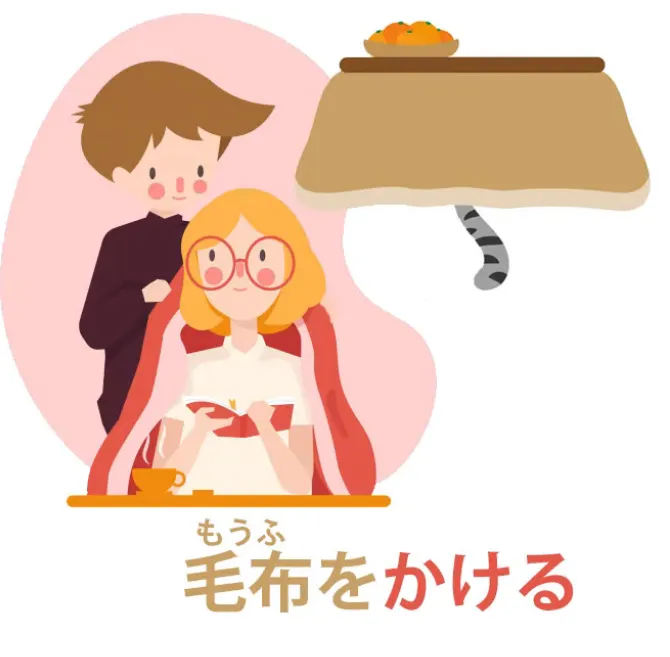

# かける
Nghĩa Tiếng Nhật là: 何かで支え（一部分を固定するようにして）、高所から落ちないようにする。(Theo Cure Dolly dịch thì nó na na giữa hai từ "hang" và "hook")

* **かける**: Tha động từ (other-move) – "móc vào", "treo vào", "gây ra", "kết nối vào".
* **かかる**: Tự động từ (self-move) – "bị vướng", "mắc vào", "treo lên", "bị dính vào".

> Cả hai đều mang ý nghĩa trung tâm là một **vật gì đó được giữ lại, dính chặt hoặc treo vào một chỗ nào đó**. Hình ảnh trung tâm gần giống với việc **móc vào hay treo lơ lửng**

### 🌟 **かける**

* Là hành động **móc, treo hoặc gài cái gì đó vào chỗ nào đó**, thường là **để giữ nó không rơi đi**.
* Cảm giác của sự **gắn chặt**, **kết nối**, **làm dính**, hoặc **bắt đầu một hành động** nào đó.

| Câu     | Nghĩa      | Giải thích                                                              |
| ------- | ---------- | ----------------------------------------------------------------------- |
| メガネをかける | Đeo kính   | Móc kính vào tai – kính "dính" vào đầu.                                 |
| 魔法をかける  | Gieo phép  | Gieo/treo "phép" lên đối tượng – làm cho phép bám vào.                  |
| 迷惑をかける  | Làm phiền  | Gây phiền như “áp” điều gì lên người khác – tạo gánh nặng, kết dính.    |
| 話しかける   | Bắt chuyện | “Kết nối” vào người kia qua lời nói – chủ động gắn kết cuộc trò chuyện. |

Một số ví dụ khác có thể kể đến như:

- 食べかけたクッキー: Cái bánh bị ăn dở (“Móc dính vào” hành động ăn – ăn rồi nhưng chưa xong → đang dở dang).
| ～しかける     | (trợ động từ) bắt đầu làm gì đó nhưng chưa hoàn thành | Biểu hiện hành động đã “bắt đầu gắn vào” nhưng chưa xong.            |

### 🌙 **かかる**

* Là **kết quả** của một thứ đã “bị treo”, “bị gắn vào”, hoặc “bị tiêu hao” (time is taken up, is suspended, is caught, in the act of learning Japanese. And the same with money. They take it, they make it adhere to themselves).
* Cảm giác không chủ động – **bị bao phủ, bị vướng phải điều gì đó**.

| Câu    | Nghĩa              | Giải thích                                                 |
| ------ | ------------------ | ---------------------------------------------------------- |
| 時間がかかる | Tốn thời gian      | Thời gian “bị treo vào” một việc → bị chiếm dụng, mắc vào. |
| お金がかかる | Tốn tiền           | Tiền “bị dính vào” hoạt động đó – mất chi phí.             |
| 詐欺にかかる | Bị lừa             | “Vướng vào” bẫy lừa đảo – bị dính bẫy.                     |
| 電話がかかる | Điện thoại kết nối | Đường dây điện thoại “móc vào” hệ thống – kết nối được.    |

> Ví dụ "日本語を覚えるのに時間がかかる": **Thời gian bị *treo* vào việc học tiếng Nhật**.

This かける as a helper verb can be used in various circumstances to indicate an unfinished action, an action that has been engaged, hooked, and then not carried through to completion.
