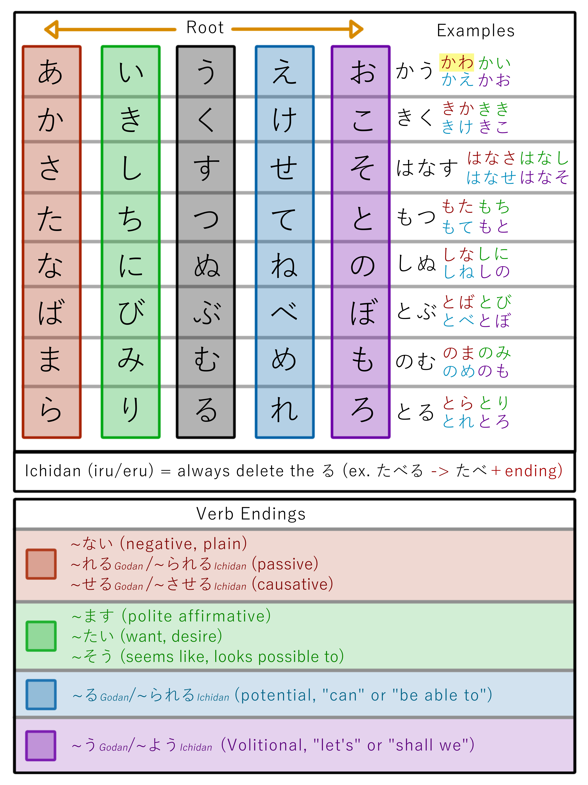

> Trích từ bài: Chia động từ (Bài 7.5)

<iframe width="560" height="315" src="https://www.youtube.com/embed/cGA6Tj9_lSg?si=NqQjf3hX-aLq1LwL" title="YouTube video player" frameborder="0" allow="accelerometer; autoplay; clipboard-write; encrypted-media; gyroscope; picture-in-picture; web-share" referrerpolicy="strict-origin-when-cross-origin" allowfullscreen></iframe>

Thực tế là: Không phải là chia động từ, mà là kết hợp thêm trợ động từ (helper verb) vào động từ gốc (đã được đổi thân từ). Bạn có thể xem video trên đây hoặc đọc phần nội dung bên dưới. Tất cả động từ tiếng Nhật kết thúc bằng một kana thuộc hàng う:
- う, く, す, つ, ぬ, ぶ, む, る (godan). VD: かう, buy; きく, hear; はなす, speak; もつ, hold; しぬ, die; とぶ, fly; のむ, drink.
- -る (ichidan). VD: とる, take.
Động từ thay đổi bằng cách chuyển âm cuối (godan) hoặc bỏ る (ichidan) → tạo ra các "sticky stem" (thân từ liên kết). Chính là thứ dùng để liên kết các trợ động từ như たい, ます và vân vân.

#### Thân từ い

Cách tạo: Chuyển kana cuối từ dòng う → dòng い:
- かう → かい
- きく → きき
- はなす → はなし

Dùng để: 
- Thêm trợ động từ ます (Tôn kính ngữ, khiêm nhường ngữ) hoặc たい (muốn làm gì): かいます, ききます, はなします, かいたい, ききたい, はなしたい. 
- Tạo danh từ kết hợp với trợ danh từ: かいもの（mua sắm）→ 買い+物, のみもの（đồ uống）→ 飲み+物 hoặc はなしかた（cách nói）→ 話し+方 (Đây là các động từ Godan rồi). Đối với Ichidan thì chỉ cần bỏ る là xong: たべる → たべ. Có thể thành: たべます, たべたい, たべもの
#### Thân từ あ

Cách tạo: Chuyển kana cuối từ dòng う → dòng あ:
- かう → かわ（ngoại lệ duy nhất!）
- きく → きか
- はなす → はなさ

Dùng để làm: 
- Thân từ cho trợ tính từ ない (phủ định): かわない, きかない, はなさない hoặc cho:
- Thể sai khiến (せる、させる): Với godan + せる (かう → かわせる) còn ichidan thì bỏ る + させる (たべる → たべさせる)
- Thể receptive (れる、られる): Với godan (động từ nhóm 1): đổi sang あ-stem → + れる còn với ichidan (động từ nhóm 2): bỏ る → + られる

### Thân từ え

Được tạo bằng cách đổi **う → え**. Ví dụ: かく thành かけ, のむ → のめ, はなす → はなせ. Đối với **ichidan (る-verbs)**: chỉ cần bỏ る → gắn て/ろ

We use the え-row sticky stem để tạo Thể khả năng (る、られる) của động từ, which means you “can do” the verb. The helper verb, which is stuck onto the え-row sticky stem, is る / られる. So, we have かえる, can buy; きける, can hear; はなせる, can speak, and so forth; plus たべられる, can eat. 
### Thân từ お

Được tạo bằng cách đổi **う → お + う**. Ví dụ: かく → かこう, のむ → のもう, はなす → はなそう.
Với **ichidan (る-verbs)**: bỏ る + よう (たべる → たべよう)

And what we do with this sticky stem is attach う, and, as you know, う when attached to お generally lengthens the お. So かう doesn’t become kao-u, it becomes かおう/kaō; 

きく becomes きこう/kikō; はなす becomes はなそう/hanasō.
かう becomes かおう, let’s buy; きく becomes きこう, let’s listen, let’s hear; はなす becomes はなそう, let’s talk.
Để tạo nên Thể ý chí
In the ichidan form, we add よう to the end of the ichidan sticky stem. (And ofc. delete る). So たべる becomes たべよう, let’s eat.
One peculiarity of the volitional form is that you can also make it by changing the form of ます to use the volitional in its formal (polite) mode.

So, いきましょう, let’s go.

Đây là một bảng để sử dụng khi cần chia.

