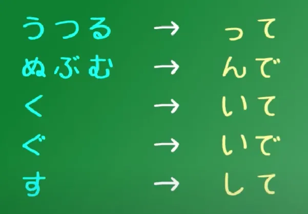

# Động từ + Thể て

<iframe width="560" height="315" src="https://www.youtube.com/embed/HAdmKhVjVs8?si=BoDdQcYnsWaBU1FO" title="YouTube video player" frameborder="0" allow="accelerometer; autoplay; clipboard-write; encrypted-media; gyroscope; picture-in-picture; web-share" referrerpolicy="strict-origin-when-cross-origin" allowfullscreen></iframe>

Về cơ bản thì ba nhóm động từ là vậy, bây giờ sẽ chuyển sang phần chuyển đổi thể động từ. Cách làm cho Ichidan thì siêu đơn giản, chỉ cần bỏ -る và thêm て hoặc た. Còn với Godan thì phức tạp hơn chút xíu.

**Nhóm Godan 1 - UTSURU/うつる**: Bỏ -う, -つ hoặc -る, rồi thay bằng -って.

- わらう thành わらって (Waratte);
- もつ thành もって (Motte);
- とる thành とって (Totte).

**Nhóm Godan 2**: Bỏ ぬ, ぶ, む rồi thay bằng -んで, với thể た thì là -んだ.

- しぬ (Động từ đuôi -ぬ duy nhất) thành しんで / しんだ;
- のむ thành のんで / のんだ
- あそぶ thành あそんで / あそんだ.

**Nhóm Godan 3 và 4** -  Nhóm く và ぐ. Bỏ -く và thay bằng -いて hoặc -いた (Với ぐ thì thành いで).

- あるく thành あるいて / あるいた.
- およぐ thành およいで.

**Nhóm Godan 5** - Nhóm -す. Bỏ -す và thêm -して

<!--  -->

- はなす thành はなして; 
- ます thành まして, đổi về quá khứ thì thành ました.

**Ngoại lệ:** Với động từ bất quy tắc (Chỉ có hai)

- くる (come) thành きて; する (do) thành して.
- いく – the verb いく (to go) – because it ends in -く, you would expect it to become いいて nhưng いって mới đúng.

Bonus thêm một video:

<iframe width="560" height="315" src="https://www.youtube.com/embed/a5HHq0HZbkM?si=Xf0gnScd9UAjKuAs" title="YouTube video player" frameborder="0" allow="accelerometer; autoplay; clipboard-write; encrypted-media; gyroscope; picture-in-picture; web-share" referrerpolicy="strict-origin-when-cross-origin" allowfullscreen></iframe>

### Câu ghép và thể て

Trong Tiếng Nhật, thể て có rất nhiều cách dùng khác nhau. Một trong những cách dùng quan trọng là dùng để nối các mệnh đề lại với nhau, tạo thành câu ghép. Khi động từ ở cuối một mệnh đề được chuyển sang thể て, nó báo hiệu rằng còn có một mệnh đề khác theo sau.

Ví dụ: `おねえちゃんはつまらない本をよんでいてあそんでくれなかった`. Đây là một câu ghép có hai mệnh đề.

Mệnh đề thứ nhất: `おねえちゃんはつまらない本をよんでいて`: "Chị gái đang/đã đọc một quyển sách nhàm chán". Động từ chính là `よんでいる` (đang đọc), chuyển sang thể て là `よんでいて`. Thể て ở cuối mệnh đề thứ nhất (`よんでいて`) có vai trò nối câu, tương tự như thêm từ "và..." vào cuối mệnh đề đó trong Tiếng Việt.

### Thể て + Trợ động từ

Người Nhật thường hay nói kết hợp trợ động từ lắm, một số ví dụ có thể kể đến:
彼は死んちゃう（死んでしまう）。

**`しまう` is talking about going ahead and doing something, something happening by accident;**